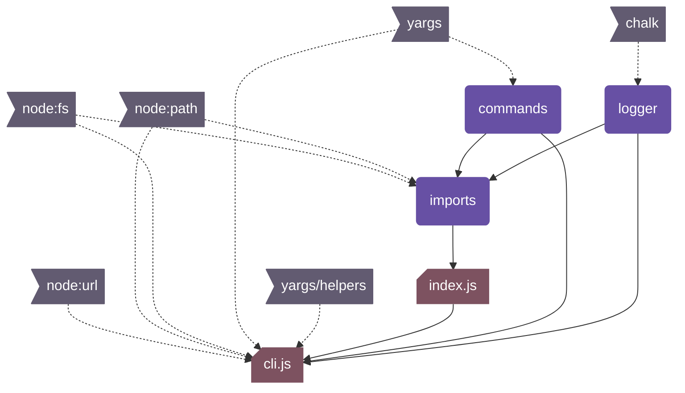
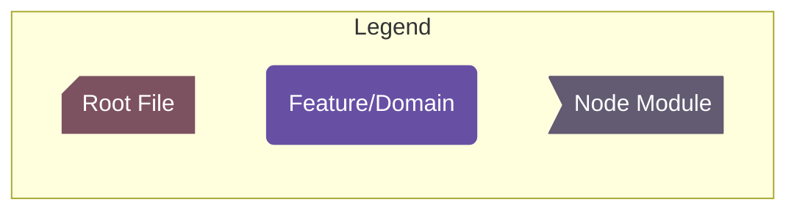

# IMPORTS

```mermaid
flowchart TB
  A9["imports"] --> A6["index.js"]
  A10["chalk"] -.-> A8["logger"]
  A4["yargs"] -.-> A7["commands"]
  A3["node:fs"] -.-> A9["imports"]
  A2["node:path"] -.-> A9["imports"]
  A7["commands"] --> A9["imports"]
  A8["logger"] --> A9["imports"]
  A0["node:url"] -.-> A1["cli.js"]
  A2["node:path"] -.-> A1["cli.js"]
  A3["node:fs"] -.-> A1["cli.js"]
  A4["yargs"] -.-> A1["cli.js"]
  A5["yargs/helpers"] -.-> A1["cli.js"]
  A6["index.js"] --> A1["cli.js"]
  A7["commands"] --> A1["cli.js"]
  A8["logger"] --> A1["cli.js"]

  A0@{ shape: odd, label: "node:url" }
  style A0 color:white,fill:#625B71,stroke:#625B71
  A1@{ shape: notch-rect, label: "cli.js" }
  style A1 color:white,fill:#7D5260,stroke:#7D5260
  A2@{ shape: odd, label: "node:path" }
  style A2 color:white,fill:#625B71,stroke:#625B71
  A3@{ shape: odd, label: "node:fs" }
  style A3 color:white,fill:#625B71,stroke:#625B71
  A4@{ shape: odd, label: "yargs" }
  style A4 color:white,fill:#625B71,stroke:#625B71
  A5@{ shape: odd, label: "yargs/helpers" }
  style A5 color:white,fill:#625B71,stroke:#625B71
  A6@{ shape: notch-rect, label: "index.js" }
  style A6 color:white,fill:#7D5260,stroke:#7D5260
  A7@{ shape: rounded, label: "commands" }
  style A7 color:white,fill:#6750A4,stroke:#6750A4
  A8@{ shape: rounded, label: "logger" }
  style A8 color:white,fill:#6750A4,stroke:#6750A4
  A9@{ shape: rounded, label: "imports" }
  style A9 color:white,fill:#6750A4,stroke:#6750A4
  A10@{ shape: odd, label: "chalk" }
  style A10 color:white,fill:#625B71,stroke:#625B71
```

```mermaid
flowchart TB
  subgraph Legend
    direction TB
    L1["Root File"]
    L2["Feature/Domain"]
    L3["Node Module"]
  end

  L1@{ shape: notch-rect, label: "Root File" }
  style L1 color:white,fill:#7D5260,stroke:#7D5260
  L2@{ shape: rounded, label: "Feature/Domain" }
  style L2 color:white,fill:#6750A4,stroke:#6750A4
  L3@{ shape: odd, label: "Node Module" }
  style L3 color:white,fill:#625B71,stroke:#625B71
```
